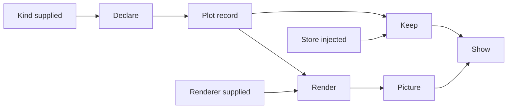

# Core Domain Distillation — tiferet-plot

**Status:** Draft · **Domain:** `plot` · **Code:** `tiferet_plot/` (intended; not seeded) · **Branch:** `main`
**Companion:** `docs/domain-vision.md`

## 1. Purpose of this document

The vision statement says what a plot is for. This document says how the domain works: the vocabulary, the behaviors, the rules those behaviors enforce, and the way the pieces relate. Read it before changing the pipeline, and before judging whether a change belongs in this package or in a neighbor.

This repository does not implement the domain yet. `tiferet_plot/` is the intended import package. The distribution name is `tiferet-plot`. No path below is a file here. There is no `config.yml`, no feature catalog, and no seeded package.

Behavioral claims are grounded in two existing trees. `tiferet:` means `greatstrength/tiferet` at `492fc22`. The calculator example in that tree is the precedent for a saved record, a service contract, a file store, and a custom session. Framework files in that same tree are the precedent for handlers, repositories, and utilities. Where a description and that code disagree, the code wins.

## 2. The core domain, restated precisely

The core domain is **declaring a plot as a record, keeping that record, rendering it, and showing the picture from the record.**

A plot is not a Matplotlib figure. It is a named claim, the data that claim depends on, and the marks that express that data. The picture is produced from the record. Matplotlib is the first tool that produces the picture. It is not a field of the record.

The catalog name is how the record is found. It is not the display title. `title` is an optional field on a plot and on a matrix: the descriptive display title. Declaration and keep do not copy the name into `title`. The title text a later drawer reads is `title` when that field is present and not blank, otherwise the name. That reading is not stored back into `title`. `description` is the subtitle. It is not a separate subtitle field, and it is not identity. Axis title and unit are four optional plot fields: `x_title`, `x_unit`, `y_title`, and `y_unit`. They are not mark roles, and a matrix does not carry them. A cell plot may carry the plot's title and axis text. Those strings are not the grid title. Drawing that text is a later step. It is not part of declaring the record.

The domain has one shape:

> **Declare** → **Keep** → **Render** → **Show**

and three axes of variation:

1. **Kind** — what chart this record is, and therefore which marks it must carry. Line, scatter, and bar are the first kinds. The kind is an input. It is not inferred from the numbers.
2. **Renderer** — the tool that turns a record into a picture. Matplotlib is the first renderer. The renderer is supplied at render time. It is not stored on the plot.
3. **Store** — where a kept record lives. The first store is a publication file, YAML or JSON. A database is the same contract, kept somewhere else, and is not part of this round. The store is an injected implementation. It is not a field of the plot.

Declaring and keeping are the same job for every combination of those axes. What changes is the kind's mark rules, the renderer, and the store class. Section 8 inventories that split.

Render does not require a store. A record can be drawn before it is kept. Show can render a record just declared, or a record just loaded. Keep is what makes the record survive the session. It is not what makes the picture possible.

## 3. Ubiquitous language

**Plot** — the declared record. It has an identity, a name, a kind, one or more series, an optional display title, an optional description, and optional axis text. The name is the catalog name. It is not the display title. The plot does not have a renderer, a file path, or a database handle.

**Series** — one named binding of data to marks inside a plot. A plot has at least one. Whether a series is a child object or a nested field is a containment choice. The record still has series either way. Renaming a series is an edit to the record, not a new plot. A series has no title, no description, and no axis text.

**Mark** — how a series expresses its data for a kind: the values, and the role those values play (for example an x position, a y position, or a bar height). The kind decides which marks are required. The renderer decides how a mark is drawn. Axis text is not a mark role.

**Kind** — one of the chart types the record may claim to be. Supplied by the caller. Not discovered from the data. The first set is line, scatter, and bar. Kind does not add or remove title or axis text.

**Title** — the optional display title of a plot or a matrix. Not the catalog name, and not identity. Omitted and blank are the same case: no title, stored as absent. The title text a later drawer reads is `title` when present and not blank, otherwise the name. That fallback is not written back into `title`.

**Description** — optional claim text beside the name. It is the subtitle a later drawer reads when it is present and not blank. It is not a separate subtitle field, and it is not identity. A blank description is no subtitle text. Storage of a supplied description is otherwise unchanged.

**Axis text** — `x_title`, `x_unit`, `y_title`, and `y_unit`, optional fields of a plot. A title may be present without its unit, and a unit without its title. They are not concatenated in the record. They are not mark roles. A matrix does not carry them. For a bar, `x_title` and `x_unit` are the text of the axis `category` is marked on, and `y_title` and `y_unit` are the text of the axis `height` is marked on. Those mark roles are not renamed.

**Declaration** — the act of building a plot record from a name, a kind, its series, and any optional title, description, and axis text. Declaration does not draw, does not save, and does not derive an id from title or from axis text.

**Record** — a plot after it has been declared. The same word covers an in-memory record and a kept record. Keeping changes where it lives, not what it is.

**Keep** — writing a record through the plot service so it can be loaded again. The first keep is a publication file.

**Publication file** — a YAML or JSON file whose job is to carry the record beside a paper or a report. It is the first store. It is not the plot.

**Store** — an implementation of the plot service. The service contract does not name a file format or a database. The first implementation is a configuration repository. A later database implementation is another class on the same contract.

**Plot service** — the contract for exists, get, list, save, and delete. Events depend on this contract. They do not open files.

**Renderer** — a service that accepts a plot record and returns a picture. Matplotlib is the first implementation. The renderer is resolved when a picture is needed. It is not saved with the plot.

**Picture** — the rendering of a record. A saved picture answers what the figure looked like. It does not answer what the figure was declared to be.

**Create** — the operation that declares a plot and keeps it. It returns the record. It does not return a picture.

**Show** — the session act of turning a record into a picture and presenting that picture. Show is not a step copied into every kind.

**Plotter session** — the custom application session that owns create and show. It is selected by its own blueprint. The generic application entry point does not discover it from configuration.

**Handler** — a blueprint-supplied callable on a session. The framework hub requires five. A plotter session adds handlers for create and show rather than copying those steps into every kind.

**Flag** — a dependency-injection namespace. Framework infrastructure resolves on `app`. A bounded context that ships its own default services uses its own flag. The calculator uses `calc`. This domain uses `plot`.

## 4. What the domain operates on

The domain does not read a plotting script. It operates on a declaration: a name, a kind, and the series that carry the data and the marks.

Two conventions give the domain its leverage.

**The kind is supplied.** A table of numbers does not say whether it is a line or a bar. The caller names the kind. That input selects the mark rules. Without it, the domain cannot say whether the declaration is well-formed for what it claims to be.

**The renderer is supplied, and it is not part of the record.** A kept plot does not say which library must draw it. The session, or the caller of render, names the renderer. That is what keeps a later drawing tool from becoming a rewrite of the plot.

The data on a series are the values to be marked. This domain does not query a database, fit a model, or decide which values belong in the figure. The person declaring the plot brings the values. Fetching them is outside.

The publication file is an input only to keep and to load. Render can run on a record that has never been written. A missing file is an empty store, not a missing domain. The calculator's formula repository already treats a missing file as an empty mapping (`tiferet:examples/basic_calculator/app/repos/formula.py (44-46)`).

## 5. The behaviors

Each behavior is a bounded step. None of these classes exist in this repository. Each subsection names the precedent that fixes the shape, then the verdict against the axes in §2.

There is no feature catalog to mirror. Section 6 says so.

### 5.1 Declare

*Turn a name, a kind, and series into a plot record.*

The precedent is `Formula` (`tiferet:examples/basic_calculator/app/domain/formula.py (16-34)`). It is a read-only domain object. Identity and derived fields are filled by a validator before construction (`tiferet:examples/basic_calculator/app/domain/formula.py (36-65)`), not by a factory method on the side. Mutation, when a record must change, lives on the aggregate (`tiferet:examples/basic_calculator/app/mappers/formula.py (14-49)`). The domain object does not import a store or a drawing library.

A plot declaration produces a record: identity, name, kind, series, an optional display title, an optional description, and optional axis text. It does not produce a picture and it does not write a file. It does not fill `title` from `name`. Omitted and blank title and axis text are stored as absent, not as empty strings.

**Agnostic on renderer and store.** Neither is an input to declaration. **Variable on kind.** Line, scatter, and bar do not require the same marks. The shared record shape is built once. The mark rules are the kind's rulebook.

The formula precedent derives `id` from `name` when `id` is missing (`tiferet:examples/basic_calculator/app/domain/formula.py (55-57)`). That convenience is not a display title. A plot's display title is the optional `title` field. Declaration does not copy `name` into `title`, and it does not derive `id` from `title` or from axis text. A missing id is the snake_case of the catalog name, once. A supplied id is kept. Renaming the name does not recompute the id and does not rewrite a supplied title. Two records may share a display title and remain two records. Section 8 records the seam.

### 5.2 Keep

*Write a record so it can be loaded again, and load it back as the same record.*

The precedent contract is `FormulaService`: exists, get, list, save, delete (`tiferet:examples/basic_calculator/app/interfaces/formula.py (14-80)`). The contract names no file format. The first implementation is `FormulaConfigRepository`, which persists through `ConfigurationRepository` under a root node (`tiferet:examples/basic_calculator/app/repos/formula.py (15-18)`, `tiferet:examples/basic_calculator/app/repos/formula.py (118-138)`). `ConfigurationRepository` dispatches on extension: `.yaml` and `.yml` to YAML, `.json` to JSON, and rejects anything else (`tiferet:tiferet/repos/core.py (21-28)`, `tiferet:tiferet/repos/core.py (67-76)`). The serialization role is `to_data` (`tiferet:tiferet/repos/core.py:54`). The transfer object excludes `id` from the stored body and the repository puts the id back on load (`tiferet:examples/basic_calculator/app/mappers/formula.py (57-61)`, `tiferet:examples/basic_calculator/app/repos/formula.py (96-98)`).

Keep produces a stored record and, on load, the same record. It does not produce a picture.

**Agnostic on kind and renderer.** A line and a bar are stored by the same contract. The renderer is not consulted. **Variable on store.** The contract is built once. The publication-file class is the first edge. A database store is a second class on the same contract, not a branch inside the file repository, and it is outside this round.

Delete is idempotent in the precedent (`tiferet:examples/basic_calculator/app/repos/formula.py (140-158)`). A missing id is not an error on delete. Get of a missing id returns nothing, and the event verifies that (`tiferet:examples/basic_calculator/app/events/formula.py (124-133)`).

### 5.3 Create

*Declare a plot and keep it, as one operation.*

The precedent is `SaveFormula`, which extends a base event that holds the service and does nothing else (`tiferet:examples/basic_calculator/app/events/formula.py (17-36)`, `tiferet:examples/basic_calculator/app/events/formula.py (62-102)`). The event constructs the aggregate, calls `save`, and returns the aggregate. It does not open a file. `GetFormula` loads through the same service. `ListFormulas` also loads through the service, then returns a rendered string (`tiferet:examples/basic_calculator/app/events/formula.py (145-163)`). That last step is presentation. It is not part of create. Section 8 says not to copy it into show.

Create produces a kept record. It does not produce a picture.

**Agnostic on renderer and store.** The event sees the plot service, not a file path and not Matplotlib. **Variable on kind** only in the marks the declaration must carry. The event does not grow a subclass per kind. The kind is an argument, and the declaration checks it.

### 5.4 Render

*Turn a record into a picture.*

There is no calculator precedent for this step. The layer precedent is a utility: a repeatable computational process behind a service, so a domain event can use it without importing the tool (`tiferet:docs/core/utils.md (14-31)`). Matplotlib is that tool for the first renderer. The utility implements a renderer service. An event or a session handler calls the service. The plot record does not import Matplotlib.

Render produces a picture. It does not write the publication file unless a caller separately keeps the record.

**Agnostic on store.** An unsaved record can be rendered. **Variable on renderer and on kind.** Matplotlib is the first renderer. Line, scatter, and bar are the first kinds it must be able to draw. A new renderer is a new implementation of the same service. A new kind is a new mark rule plus a drawing path in the renderer, not a new plot type in the declaration.

The architecture skill permits an event to import a utility (`tiferet:.agents/skills/tiferet-code-architecture/SKILL.md:25`). The calculator's formula events do not (`tiferet:examples/basic_calculator/app/events/formula.py (8-12)`). Permission is not a reason for a create event to import Matplotlib. Render stays behind the renderer service. Section 8 records the trap.

### 5.5 Show

*From the session, create a plot and present a picture of a record.*

The precedent is `CalculatorAppContext`. It extends the session hub, omits `domain_type` so `AppSession` stays registered to `AppSessionContext` (`tiferet:examples/basic_calculator/app/contexts/calc.py (98-106)`), and adds one session-level handler instead of a step on every feature (`tiferet:examples/basic_calculator/app/contexts/calc.py (123-132)`, `tiferet:examples/basic_calculator/app/contexts/calc.py (177-225)`). The hub already requires five handlers and fails if one is unwired (`tiferet:tiferet/contexts/app.py (154-160)`, `tiferet:tiferet/contexts/app.py (37-64)`). An extra handler uses the same failure (`tiferet:examples/basic_calculator/app/contexts/calc.py (216-222)`).

`build_app` always constructs `AppSessionContext` (`tiferet:tiferet/blueprints/app.py (34-35)`, `tiferet:tiferet/blueprints/app.py (76-79)`). It does not read a context class from the session. The calculator therefore has its own blueprint, which selects `CalculatorAppContext` itself (`tiferet:examples/basic_calculator/app/blueprints/calc.py (139-182)`). The comment at `tiferet:examples/basic_calculator/app/blueprints/calc.py (144-147)` states the limit. A plotter session has the same limit.

Show produces a picture, and create-through-the-session produces a kept record. Showing does not require that the record was kept in this call. Creating does not show.

**Agnostic on kind.** One session covers line, scatter, and bar. A new kind does not add a show step. **Variable on renderer** only because the show handler resolves the renderer service. **Agnostic on store** except where create keeps. The session does not open the publication file itself.

Default kinds, if they ship with the session, are seeded onto the cache and registered under the `plot` flag, the way arithmetic defaults are seeded and registered under `calc` (`tiferet:examples/basic_calculator/app/blueprints/calc.py (25-47)`, `tiferet:examples/basic_calculator/app/blueprints/calc.py (69-111)`, `tiferet:examples/basic_calculator/app/contexts/calc.py (73-93)`). Those defaults are ordinary feature services. They are not app-level singletons. The calculator's record-run event is resolved on `app`, not on `calc` (`tiferet:examples/basic_calculator/app/blueprints/calc.py (133)`). That split is the seam. Section 8 says what goes wrong if the renderer is put on `app` because that was convenient.

## 6. How the behaviors compose

Nothing in this repository composes these behaviors yet. There is no feature file and no session configuration. The composition below is the intended path, not a configured pipeline.

A caller declares a plot, or asks the session to create one. Create declares and keeps. Render draws whatever record it is given. Show asks the renderer for a picture and presents it. Keep is on the create path and on any later save. It is not on the render path.

The session's create handler is Declare then Keep. The session's show handler is Render. They are handlers on one context, not steps duplicated per kind. `App(...)` is not in this diagram. It cannot select the context (`tiferet:tiferet/blueprints/app.py (45-49)`).

## 7. Relationships

A plot contains series. A series carries data and marks. The kind is not contained in the data. It is an input that selects which marks are legal. A renderer is not contained in the plot. It is an input that selects how legal marks are drawn. A store is not contained in the plot. It is the implementation bound to the plot service.

Judging those relationships requires the kind, and only the kind, at declaration time. Without a kind, the domain cannot say the marks are well-formed. The renderer is required only at render time. The store is required only at keep and load time. A picture is never evidence for any of the three. It is an output.

Events receive services. They do not receive the session, and they do not construct repositories. The session receives handlers from the blueprint. It does not import the renderer module to call Matplotlib. Repositories are not package exports. The calculator repository is constructed by dependency injection, not imported by the event (`tiferet:examples/basic_calculator/app/events/formula.py (11-12)`).

The import law allows an event to import a utility. That permission does not make Matplotlib a legal dependency of declaration or of create. The domain boundary is the renderer service. Section 8 is the place that mistake would show up.

## 8. The agnostic core and the variable edge

**Built once**

- The plot record: identity, name, kind, series, optional display title, optional description, and optional axis text. The catalog name is not the display title. Id is not derived from title or from axis text.
- A matrix record carries an optional display title and does not carry axis text. A cell plot may carry the plot's title and axis text. Those are not the grid title.
- The plot service contract: exists, get, list, save, delete.
- Create, get, and list as events on that contract. Create does not render.
- The session handlers for create and show, and the rule that `App(...)` will not select the session.
- The rule that kind and renderer are inputs, not guesses.

**Varies per case**

- Kind rules for line, scatter, and bar: which marks are required.
- The renderer implementation. Matplotlib is the first.
- The store implementation. A publication file is the first. A database store is the same contract and a later case.

**Entanglement inventory**

These are seams in the precedents, not files in this repository. They are listed so the plot domain does not copy them by accident.

- `ListFormulas.execute` returns a display string (`tiferet:examples/basic_calculator/app/events/formula.py (145-163)`). Retrieval and presentation are one event. Show must not be that. A list of plots returns records. A picture comes from render.
- `record_run_handler` resolves its event on the `app` flag (`tiferet:examples/basic_calculator/app/blueprints/calc.py:133`) while the bounded-context services are registered on `calc` (`tiferet:examples/basic_calculator/app/blueprints/calc.py:111`). The split is correct for a session-level history event. It is the wrong place for a renderer. A renderer registered on `app` because the show handler already closes over `app` would hide the drawing tool inside framework infrastructure.
- `build_app` constructs `AppSessionContext` by name (`tiferet:tiferet/blueprints/app.py (34-35)`, `tiferet:tiferet/blueprints/app.py (76-79)`). A session configuration that names a plotter context class will not be honored. The calculator already documents that (`tiferet:examples/basic_calculator/app/blueprints/calc.py (144-147)`). Treating configuration as the way to select the session is the entanglement.
- `Formula._derive_fields` writes `id` from `name` when `id` is absent (`tiferet:examples/basic_calculator/app/domain/formula.py (55-57)`). That convenience must not be mistaken for a display title. Identity and display title are not the same field. Declaration does not copy the catalog name into `title`, and it does not derive `id` from `title`. Two publication records with the same display title remain two records. A missing id is still the snake_case of the catalog name, once, and a rename does not recompute it.
- The architecture skill lists `utils` as a legal import for `events` (`tiferet:.agents/skills/tiferet-code-architecture/SKILL.md:25`). The formula events do not use that permission (`tiferet:examples/basic_calculator/app/events/formula.py (8-12)`). An event that imported Matplotlib because the skill allows utilities would entangle render with create. The import law is not the domain boundary.

The file repository is not an entanglement. `FormulaService` does not mention YAML (`tiferet:examples/basic_calculator/app/interfaces/formula.py (14-16)`). The path sits on the repository constructor (`tiferet:examples/basic_calculator/app/repos/formula.py:22`). A database store that added a file argument to the plot record would be the entanglement. The precedent does not do that.

## 9. Boundaries

Inside this domain: the plot record, series and marks, the kind rules for line, scatter, and bar, the plot service, the publication-file store, the Matplotlib renderer, and the plotter session that creates and shows.

Outside, and who owns it:

- Which data belong in the figure, and whether the claim is true. The person declaring the plot.
- How a mark is stroked, filled, or labeled in a particular library. Matplotlib, behind the renderer service. This domain says what is being drawn.
- Application startup, the five required handlers, feature execution, and dependency injection. The Tiferet framework. This domain supplies a session and a blueprint. It does not replace `build_app`.
- A database store. A later round, on the same plot service. Not a second contract.
- Histogram, image, heatmap, three-dimensional charts, and other drawing libraries. Later kinds and later renderers. Not this round.
- A command-line tool. Later work. The calculator needed one because it had a command-line entry point. This domain's session is create and show.
- Publishing the paper, or owning the database product. This domain produces the record those can hold, and the picture rendered from that record.

## 10. Where this leads

Each item is a candidate for its own RFP. None of them is a change to make in this document.

1. **Plot as declared data.** Settle the record: identity, name, kind, series, and marks, including an id that is not derived from the name. Cite §2, §3, §5.1, and the id seam in §8. This blocks every later candidate.
2. **Saving a plot.** Settle the plot service and the publication-file store. Cite §5.2 and §4. A database store is named out of scope, not given an RFP in this round.
3. **Creating a plot.** Settle the events that declare, save, get, and list. Cite §5.3. They must not render. They must not return a picture.
4. **Rendering a plot.** Settle the renderer service and the Matplotlib utility for line, scatter, and bar. Cite §5.4 and the import-law seam in §8. No further kinds.
5. **The plotter session.** Settle the custom context, the `plot` flag, the cache-seeded defaults, and the create and show handlers. Cite §5.5 and the `build_app` seam in §8. No command-line tool.
